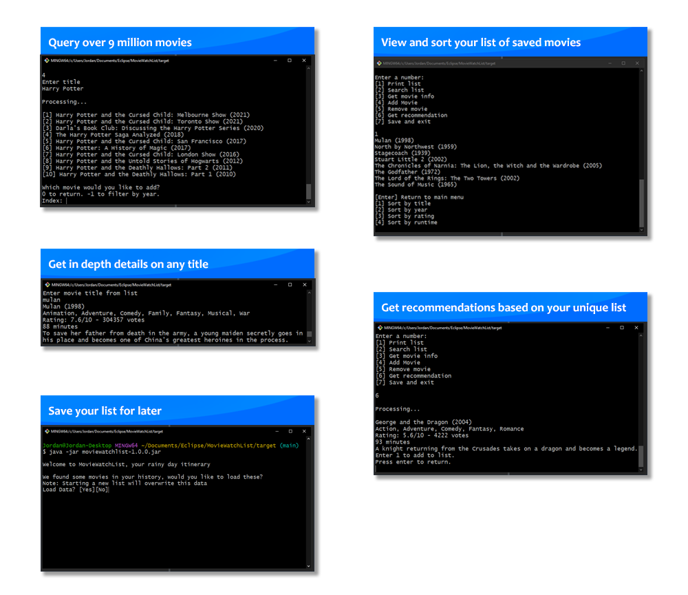

<a name="readme-top"></a>

<br />
<div align="center">
  <a href="https://github.com/JLavigueure/MovieWatchList">
    
  </a>

  <h3 align="center">Movie Watchlist</h3>

  <p align="center">
    Build your cinema agenda.
    <br />
    <a href="https://github.com/JLavigueure/MovieWatchList/tree/main/src/main/java/moviewatchlist"><strong>Explore the docs »</strong></a>
    <br />
    <br />
    <a href="https://github.com/JLavigueure/MovieWatchList">View Demo</a>
    ·
    <a href="https://github.com/JLavigueure/MovieWatchList/issues">Report Bug</a>
    ·
    <a href="https://github.com/JLavigueure/MovieWatchList/issues">Request Feature</a>
  </p>
</div>

## About The Project

<div align="center">
  <a href="https://github.com/JLavigueure/MovieWatchList">
    
  </a>
</div>

Movie Watchlist is a terminal based program that allows you to query over 9 million titles via external API (<a href="https://rapidapi.com/SAdrian/api/moviesdatabase/">MoviesDatabase</a>), and save the movies you find interesting for a later time into a local NoSQL (Json) database. In addition, it provides movie recommendations using an algorithm that looks at your unique list and finds popular related titles. 

<p align="right">(<a href="#readme-top">back to top</a>)</p>

### Built With

* 
* 
* <a href="https://github.com/google/gson">Gson</a>
* <a href="https://github.com/junit-team">JUnit</a>

### Skills
Object oriented programming(OOP), API interaction, File writing and reading

<p align="right">(<a href="#readme-top">back to top</a>)</p>

<!-- GETTING STARTED -->
## Getting Started

### Prerequisites
* <a href="https://maven.apache.org/download.cgi">Maven</a>

### Installation
1. Clone the repo in your designated folder
   ```sh
   git clone https://github.com/JLavigueure/MovieWatchList.git
   ```
2. Move into repo directory
   ```sh
   cd MovieWatchList/
   ```
 3. Install Maven packages to target folder
    ```sh
    mvn dependency:copy-dependencies 
    ```
4. Build into jar executable
   ```sh
   mvn package
   ```
5. Run 
   ```sh
   java -jar target/moviewatchlist-1.0.0.jar
   ```
<p align="right">(<a href="#readme-top">back to top</a>)</p>

<!-- USAGE EXAMPLES -->
## Usage
<div align="center">
  <a href="https://github.com/JLavigueure/MovieWatchList">
    
  </a>
</div>

<p align="right">(<a href="#readme-top">back to top</a>)</p>

<!-- CONTACT -->
## Contact

* Jordan Lavigueure
* lav.jordan@live.com
* <a href="https://www.linkedin.com/in/jordanlavigueure">
  
  </a>
* <a href="https://github.com/JLavigueure">
  
  </a>


<p align="right">(<a href="#readme-top">back to top</a>)</p>


